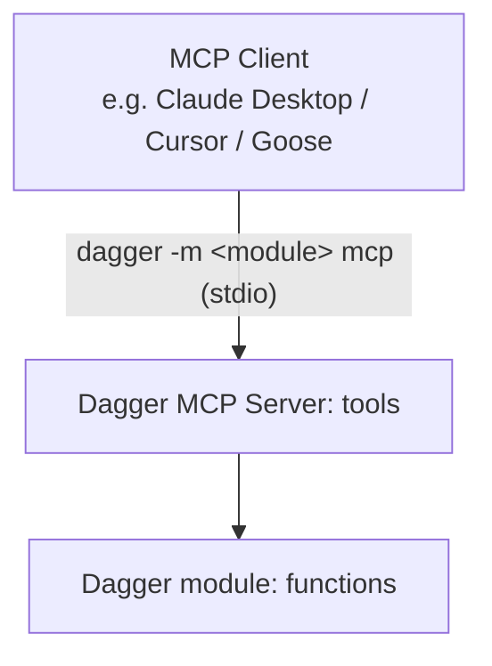
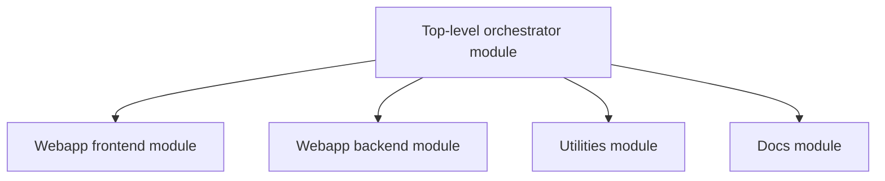
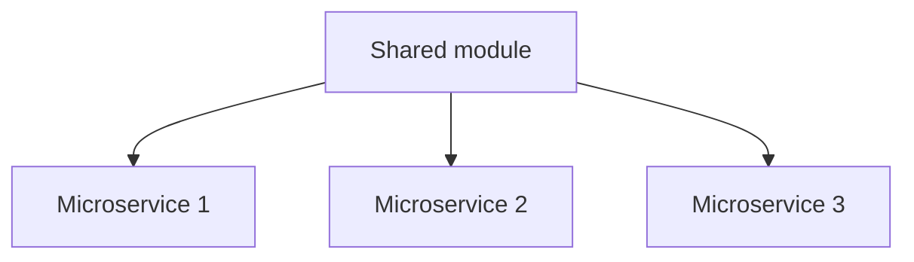

import Tabs from '@theme/Tabs';
import TabItem from '@theme/TabItem';
import VideoPlayer from '../src/components/VideoPlayer';

# Use Cases

## Agentic CI

Dagger can be used as a runtime and programming environment for AI agents. Dagger provides an `LLM` core type that enables native integration of Large Language Models (LLM) in your workflows.

### Tool use

A key feature of Dagger's LLM integration is out-of-the-box support for tool use using Dagger Functions: an LLM can automatically discover and use any available Dagger Functions in the provided environment.


#### Environments

Environments configure any number of inputs and outputs for the LLM. For example, an environment might provide a `Directory`, a `Container`, a custom module, and a `string` variable. The LLM can use these objects and their Dagger Functions to complete the assigned task.

The documentation for the modules are provided to the LLM via [inline documentation](./extending/documentation.mdx) in your Dagger Functions. The LLM can then analyze the available tools and select which ones to use.

Here's an example:

<Tabs groupId="shell">

<TabItem value="Dagger Shell">
```shell label="First type 'dagger' for interactive mode."
base=$(container | from alpine)
env=$(env | with-container-input 'base' $base 'a base container' | with-container-output 'python-dev' 'a container with python dev tools')
llm | with-env $env | with-prompt "You have an alpine container. Install tools to develop with Python." | env | output python-dev | as-container | terminal
```
</TabItem>

<TabItem value="System shell">
```shell
dagger <<EOF
base=\$(container | from alpine)
env=\$(env |
  with-container-input 'base' \$base 'a base container' |
  with-container-output 'python-dev' 'a container with python dev tools')
llm |
  with-env \$env |
  with-prompt "You have an alpine container. Install tools to develop with Python." |
  env |
  output python-dev |
  as-container |
  terminal
EOF
```
</TabItem>

</Tabs>

Here, an instance of a `Container` is attached as an input to the `Env` environment. The `Container` is a core type with a number of useful functions, such as `withNewFile()` and `withExec()`. When this environment is attached to an `LLM`, the LLM can call any of these Dagger Functions to change the state of the `Container` and complete the assigned task.

#### Agent loop

Consider the following Dagger Function:

<Tabs groupId="language" queryString="sdk">
<TabItem value="go" label="Go">
```go file=./quickstart/agent/snippets/part1/go/main.go
```
</TabItem>
<TabItem value="python" label="Python">
```python file=./quickstart/agent/snippets/part1/python/src/coding_agent/main.py
```
</TabItem>
<TabItem value="typescript" label="TypeScript">
```typescript file=./quickstart/agent/snippets/part1/typescript/src/index.ts
```
</TabItem>
</Tabs>

This Dagger Function creates a new LLM, gives it an environment (a container with various tools) with an assignment, and prompts it to complete the assignment. The LLM then runs in a loop, calling tools and iterating on its work, until it completes the assignment. This loop happens inside the LLM object, so the value of `result` is the environment with the completed assignment.

### MCP

Model Context Protocol (MCP) support in Dagger can be broken into two categories:

1. Exposing MCP outside Dagger
1. Connecting to external MCP servers from Dagger

#### Expose MCP outside Dagger

Dagger has built-in MCP support that allows you to easily expose Dagger modules as an MCP server. This allows you to configure a client (such as Claude Desktop, Cursor, Goose CLI/Desktop) to consume modules from [the Daggerverse](https://daggerverse.dev) or any Git repository as native MCP servers.

:::warning
Currently, only Dagger modules with no required constructor arguments are supported when exposing an MCP server outside  Dagger.
:::



### Connect to external MCP servers from Dagger

:::note
Support for connecting to external MCP servers from Dagger is coming soon.
:::

### Prompt mode

Dagger Shell lets you interact with the attached LLM using natural language commands. Each input builds upon previous interactions, creating a prompt chain that lets you execute complex workflows without needing to know the exact syntax of the underlying Dagger API.

:::note
"Prompt mode" can be accessed at any time in the Dagger Shell by typing the `>` character.
:::

Here's an example:

```shell wrap
source=$(container | from node | with-mounted-directory /src https://github.com/dagger/hello-dagger | with-workdir /src)

You have a container with source code in /src. Describe the source code.

Does the application have unit tests?

Find all the unit tests. Deduce what the application does. Describe it in one paragraph.
```

### Supported models

Dagger supports a wide range of popular language models, including those from OpenAI, Anthropic and Google. Dagger can access these models either through their respective cloud-based APIs or using local providers like Docker Model Runner or Ollama.

Dagger uses your system's standard environment variables to route LLM requests. Dagger will look for these variables in your environment, or in a `.env` file in the current directory. Learn more about configuring LLM endpoints in Dagger.

### Observability

Dagger provides [end-to-end tracing] of prompts, tool calls, and even low-level system operations. All agent state changes are observable in real time.

### Learn more

- [Build an AI agent with our quickstart]
- [Browse examples of agentic workflows]
- [Learn about the agent loop and how to work with LLM prompts and responses]
- [Configure LLM endpoints]

## Modern CI

This guide will show you how to build a modern CI workflow for an application using Dagger. Workflows often start simple, but eventually transform into a labyrinth of artisanal shell scripts and/or unmanageable YAML code. Dagger lets you replace those artisanal scripts and YAML with a modern API and cross-language scripting engine.

### Requirements

This guide will take you approximately 10 minutes to complete. You should be familiar with programming in Go, Python,  TypeScript, PHP, or Java.

Before beginning, ensure that:
- you have [installed the Dagger CLI](./installation.mdx).
- you know [the basics of Dagger](./quickstart/core-concepts/index.mdx).
- you have [Git](https://git-scm.com/downloads) and a container runtime installed on your system and running. This can be [Docker](https://docs.docker.com/engine/install/), [Podman](https://podman.io/docs/installation), [nerdctl](https://github.com/containerd/nerdctl), or other Docker-like systems.
- you have a GitHub account (optional, only if configuring Dagger Cloud)

### Get the example application
The example application is a skeleton Vue framework application that returns a "Hello from Dagger!" welcome page. Create a Github repository from the [hello-dagger-template](https://github.com/dagger/hello-dagger-template) and set it as the current working directory:

In the GitHub UI:

Clone your new repository and set it as the current working directory.


Or with the `gh` CLI:
```shell wrap
gh repo create hello-dagger --template dagger/hello-dagger-template --public --clone
cd hello-dagger
```

### Sign up for Dagger Cloud (optional)
:::info
This step is optional and will create a [Dagger Cloud](https://dagger.io/cloud) account, which is free of charge for a single user. If you prefer not to sign up for Dagger Cloud, you can skip this section.
:::

Dagger Cloud is an online visualization tool for Dagger workflows. It provides a web interface to visualize each step of your workflow, drill down to detailed logs, understand how long operations took to run, and whether operations were cached.

Create a new Dagger Cloud account by running `dagger login`:

```shell
dagger login
```

The Dagger CLI will invite you to authenticate your device by displaying a link containing a unique key. Click the link in your browser, and verify that you see the same key in the Dagger Cloud Web interface.

```shell
$ dagger login
Browser opened to: https://auth.dagger.cloud/activate?user_code=FCNP-SRLM
Confirmation code: FCNP-SRLM
```

Once you confirm your authentication code, your Dagger CLI will be authenticated and you will get redirected to your newly created Dagger Cloud organization.

After successfully creating your organization, all future Dagger workflows can be inspected in Dagger Cloud.

### Initialize a Dagger module

Bootstrap a new Dagger module in Go, Python, TypeScript, PHP, or Java by running `dagger init` in the application's root directory.

<Tabs groupId="language" queryString="sdk">
<TabItem value="go" label="Go">

```shell
dagger init --sdk=go --name=hello-dagger
```

</TabItem>
<TabItem value="python" label="Python">

```shell
dagger init --sdk=python --name=hello-dagger
```

</TabItem>
<TabItem value="typescript" label="TypeScript">

```shell
dagger init --sdk=typescript --name=hello-dagger
```

</TabItem>
<TabItem value="php" label="PHP">

```shell
dagger init --sdk=php --name=hello-dagger
```

</TabItem>
<TabItem value="java" label="Java">

```shell
dagger init --sdk=java --name=hello-dagger
```

</TabItem>
</Tabs>

This will generate a `dagger.json` [module metadata file] and a `.dagger` directory containing some boilerplate Dagger Functions as examples.

To see the generated Dagger Functions, run:

```shell
dagger functions
```

You should see information about two auto-generated Dagger Functions: `container-echo` and `grep-dir`.

### Construct a workflow
Replace the generated Dagger module files as described below.

<Tabs groupId="language" queryString="sdk">
<TabItem value="go" label="Go">

Replace the generated `.dagger/main.go` file with the following code, which adds four Dagger Functions to your Dagger module:

```go Go icon="golang" expandable
package main

import (
	"context"
	"fmt"
	"math"
	"math/rand"

	"dagger/hello-dagger/internal/dagger"
)

type HelloDagger struct{}

// Publish the application container after building and testing it on-the-fly
func (m *HelloDagger) Publish(
	ctx context.Context,
	// +defaultPath="/"
	source *dagger.Directory,
) (string, error) {
	_, err := m.Test(ctx, source)
	if err != nil {
		return "", err
	}
	return m.Build(source).
		Publish(ctx, fmt.Sprintf("ttl.sh/hello-dagger-%.0f", math.Floor(rand.Float64()*10000000))) //#nosec
}

// Build the application container
func (m *HelloDagger) Build(
	// +defaultPath="/"
	source *dagger.Directory,
) *dagger.Container {
	build := m.BuildEnv(source).
		WithExec([]string{"npm", "run", "build"}).
		Directory("./dist")
	return dag.Container().From("nginx:1.25-alpine").
		WithDirectory("/usr/share/nginx/html", build).
		WithExposedPort(80)
}

// Return the result of running unit tests
func (m *HelloDagger) Test(
	ctx context.Context,
	// +defaultPath="/"
	source *dagger.Directory,
) (string, error) {
	return m.BuildEnv(source).
		WithExec([]string{"npm", "run", "test:unit", "run"}).
		Stdout(ctx)
}

// Build a ready-to-use development environment
func (m *HelloDagger) BuildEnv(
	// +defaultPath="/"
	source *dagger.Directory,
) *dagger.Container {
	nodeCache := dag.CacheVolume("node")
	return dag.Container().
		From("node:21-slim").
		WithDirectory("/src", source).
		WithMountedCache("/root/.npm", nodeCache).
		WithWorkdir("/src").
		WithExec([]string{"npm", "install"})
}
```

</TabItem>
<TabItem value="python" label="Python">

Replace the generated `.dagger/src/hello_dagger/main.py` file with the following code, which adds four Dagger Functions to your Dagger module:

```python Python icon="python" expandable
import random
from typing import Annotated

import dagger
from dagger import DefaultPath, Doc, dag, function, object_type


@object_type
class HelloDagger:
    @function
    async def publish(
        self,
        source: Annotated[
            dagger.Directory, DefaultPath("/"), Doc("hello-dagger source directory")
        ],
    ) -> str:
        """Publish the application container after building and testing it on-the-fly"""
        await self.test(source)
        return await self.build(source).publish(
            f"ttl.sh/hello-dagger-{random.randrange(10**8)}"
        )

    @function
    def build(
        self,
        source: Annotated[
            dagger.Directory, DefaultPath("/"), Doc("hello-dagger source directory")
        ],
    ) -> dagger.Container:
        """Build the application container"""
        build = (
            self.build_env(source)
            .with_exec(["npm", "run", "build"])
            .directory("./dist")
        )
        return (
            dag.container()
            .from_("nginx:1.25-alpine")
            .with_directory("/usr/share/nginx/html", build)
            .with_exposed_port(80)
        )

    @function
    async def test(
        self,
        source: Annotated[
            dagger.Directory, DefaultPath("/"), Doc("hello-dagger source directory")
        ],
    ) -> str:
        """Return the result of running unit tests"""
        return await (
            self.build_env(source)
            .with_exec(["npm", "run", "test:unit", "run"])
            .stdout()
        )

    @function
    def build_env(
        self,
        source: Annotated[
            dagger.Directory, DefaultPath("/"), Doc("hello-dagger source directory")
        ],
    ) -> dagger.Container:
        """Build a ready-to-use development environment"""
        node_cache = dag.cache_volume("node")
        return (
            dag.container()
            .from_("node:21-slim")
            .with_directory("/src", source)
            .with_mounted_cache("/root/.npm", node_cache)
            .with_workdir("/src")
            .with_exec(["npm", "install"])
        )
```

</TabItem>
<TabItem value="typescript" label="TypeScript">

Replace the generated `.dagger/src/index.ts` file with the following code, which adds four Dagger Functions to your Dagger module:

```typescript TypeScript icon="javascript" expandable
import {
  dag,
  Container,
  Directory,
  object,
  func,
  argument,
} from "@dagger.io/dagger"

@object()
export class HelloDagger {
  /**
   * Publish the application container after building and testing it on-the-fly
   */
  @func()
  async publish(
    @argument({ defaultPath: "/" }) source: Directory,
  ): Promise<string> {
    await this.test(source)
    return await this.build(source).publish(
      "ttl.sh/hello-dagger-" + Math.floor(Math.random() * 10000000),
    )
  }

  /**
   * Build the application container
   */
  @func()
  build(@argument({ defaultPath: "/" }) source: Directory): Container {
    const build = this.buildEnv(source)
      .withExec(["npm", "run", "build"])
      .directory("./dist")
    return dag
      .container()
      .from("nginx:1.25-alpine")
      .withDirectory("/usr/share/nginx/html", build)
      .withExposedPort(80)
  }

  /**
   * Return the result of running unit tests
   */
  @func()
  async test(
    @argument({ defaultPath: "/" }) source: Directory,
  ): Promise<string> {
    return this.buildEnv(source)
      .withExec(["npm", "run", "test:unit", "run"])
      .stdout()
  }

  /**
   * Build a ready-to-use development environment
   */
  @func()
  buildEnv(@argument({ defaultPath: "/" }) source: Directory): Container {
    const nodeCache = dag.cacheVolume("node")
    return dag
      .container()
      .from("node:21-slim")
      .withDirectory("/src", source)
      .withMountedCache("/root/.npm", nodeCache)
      .withWorkdir("/src")
      .withExec(["npm", "install"])
  }
}
```

</TabItem>
<TabItem value="php" label="PHP">

Replace the generated `.dagger/src/HelloDagger.php` file with the following code, which adds four Dagger Functions to your Dagger module:

```php PHP icon="php" expandable
<?php

declare(strict_types=1);

namespace DaggerModule;

use Dagger\Attribute\DaggerFunction;
use Dagger\Attribute\DaggerObject;
use Dagger\Attribute\DefaultPath;
use Dagger\Attribute\Doc;
use Dagger\Container;
use Dagger\Directory;

use function Dagger\dag;

#[DaggerObject]
class HelloDagger
{
    #[DaggerFunction]
    #[Doc('Publish the application container after building and testing it on-the-fly')]
    public function publish(
      #[DefaultPath('/')]
      Directory $source,
    ): string {
        $this->test($source);

        return $this
            ->build($source)
            ->publish('ttl.sh/hello-dagger-' . rand(0, 10000000));
    }

    #[DaggerFunction]
    #[Doc('Build the application container')]
    public function build(
      #[DefaultPath('/')]
      Directory $source,
    ): Container {
        $build = $this
            ->buildEnv($source)
            ->withExec(['npm', 'run', 'build'])
            ->directory('./dist');

        return dag()
            ->container()
            ->from('nginx:1.25-alpine')
            ->withDirectory('/usr/share/nginx/html', $build)
            ->withExposedPort(80);
    }

    #[DaggerFunction]
    #[Doc('Return the result of running unit tests')]
    public function test(
      #[DefaultPath('/')]
      Directory $source,
    ): string {
        return $this
            ->buildEnv($source)
            ->withExec(['npm', 'run', 'test:unit', 'run'])
            ->stdout();
    }

    #[DaggerFunction]
    #[Doc('Build a ready-to-use development environment')]
    public function buildEnv(
      #[DefaultPath('/')]
      Directory $source,
    ): Container {
        $nodeCache = dag()
            ->cacheVolume('node');

        return dag()
            ->container()
            ->from('node:21-slim')
            ->withDirectory('/src', $source)
            ->withMountedCache('/root/.npm', $nodeCache)
            ->withWorkdir('/src')
            ->withExec(['npm', 'install']);
    }
}
```

</TabItem>
<TabItem value="java" label="Java">

Replace the generated `.dagger/src/main/java/io/dagger/modules/hellodagger/HelloDagger.java` file with the following code, which adds four Dagger Functions to your Dagger module:

```java Java icon="java" expandable
package io.dagger.modules.hellodagger;

import static io.dagger.client.Dagger.dag;

import io.dagger.client.Container;
import io.dagger.client.exception.DaggerQueryException;
import io.dagger.client.Directory;
import io.dagger.client.CacheVolume;
import io.dagger.module.annotation.DefaultPath;
import io.dagger.module.annotation.Function;
import io.dagger.module.annotation.Object;
import java.util.List;
import java.util.concurrent.ExecutionException;

/** HelloDagger main object */
@Object
public class HelloDagger {
  /** Publish the application container after building and testing it on-the-fly */
  @Function
  public String publish(@DefaultPath("/") Directory source)
      throws InterruptedException, ExecutionException, DaggerQueryException {
    this.test(source);
    return this.build(source).
        publish("ttl.sh/hello-dagger-%d".formatted((int) (Math.random() * 10000000)));
  }

  /** Build the application container */
  @Function
  public Container build(@DefaultPath("/") Directory source)
      throws InterruptedException, ExecutionException, DaggerQueryException {
    Directory build = this
        .buildEnv(source)
        .withExec(List.of("npm", "run", "build"))
        .directory("./dist");
    return dag().container()
        .from("nginx:1.25-alpine")
        .withDirectory("/usr/share/nginx/html", build)
        .withExposedPort(80);
  }

  /** Return the result of running unit tests */
  @Function
  public String test(@DefaultPath("/") Directory source)
      throws InterruptedException, ExecutionException, DaggerQueryException {
    return this
        .buildEnv(source)
        .withExec(List.of("npm", "run", "test:unit", "run"))
        .stdout();
  }

  /** Build a ready-to-use development environment */
  @Function
  public Container buildEnv(@DefaultPath("/") Directory source)
      throws InterruptedException, ExecutionException, DaggerQueryException {
    CacheVolume nodeCache = dag().cacheVolume("node");
    return dag().container()
        .from("node:21-slim")
        .withDirectory("/src", source)
        .withMountedCache("/root/.npm", nodeCache)
        .withWorkdir("/src")
        .withExec(List.of("npm", "install"));
  }
}
```

</TabItem>
</Tabs>

In this Dagger module, each Dagger Function performs a different operation:

- The `publish` Dagger Function tests, builds and publishes a container image of the application to a registry.
- The `test` Dagger Function runs the application's unit tests and returns the results.
- The `build` Dagger Function performs a multi-stage build and returns a final container image with the production-ready application and an NGINX Web server to host and serve it.
- The `build-env` Dagger Function creates a container with the build environment for the application.

### Run the Dagger module

Dagger Shell is the fastest way to interact with the Dagger API, allowing access to both core types and custom Dagger Functions using a familiar Bash-like syntax. Type `dagger` to launch Dagger Shell in interactive mode.

```shell
publish
```

This single command runs the application's tests, then builds and publishes it as a container image to the [ttl.sh container registry](https://ttl.sh). Here's what you should see:

<VideoPlayer src="/img/current_docs/quickstart/ci/publish.webm" alt="Publishing the container" />

You can test the published container image by pulling and running it with `docker run`:

<VideoPlayer src="/img/current_docs/quickstart/ci/docker.webm" alt="Running the published container with Docker" />

If you signed up for Dagger Cloud, the output of the previous command would have also included a link to visualize the workflow run on Dagger Cloud. Click the link in your browser to see a complete breakdown of the steps performed. Here's what you should see:

<VideoPlayer src="/img/current_docs/quickstart/ci/trace.webm" alt="Visualizing the workflow in Dagger Cloud" />


### Interact with the build environment
The `build-env` Dagger Function returns a `Container` type representing the application's build environment. One of the most interesting built-in Dagger Functions of this type is `terminal`, which can be used to [open an interactive terminal session with the running container](./features/observability.mdx).

To try this, chain an additional function call to `terminal` on the returned `Container`:

```shell
build-env | terminal --cmd=bash
```

This command builds the container image and then drops you into an interactive terminal running the `bash` shell. You can now directly execute commands in the running container, as shown below:

<VideoPlayer src="/img/current_docs/quickstart/ci/buildenv-terminal.webm" alt="Interactive terminal in build environment" />

### Run a container as a local service

The `build` Dagger Function returns a `Container` type representing the built container image. Another interesting built-in function to explore here is the `as-service` function, which can be used to [start a container as a local service](./features/services.mdx) and have any exposed ports forwarded to the host machine. This is similar to Docker Compose, except that you're using code instead of YAML to manage your services.

To try this, use the function chain below:

```shell
build | as-service | up --ports=8080:80
```

By default, Dagger will map each exposed container service port to the same port on the host. Since NGINX operates on port 80, which is often a privileged port on the host, the additional `--ports 8080:80` argument re-maps container port 80 to unprivileged host port 8080.

<VideoPlayer src="/img/current_docs/quickstart/ci/build-service.webm" alt="Final container as service" />

You should now be able to access the application by browsing to `http://localhost:8080` on the Dagger host (replace `localhost` with your Dagger host's network name or IP address if accessing it remotely). You should see a "Hello from Dagger!" welcome page, served by NGINX.

<VideoPlayer src="/img/current_docs/quickstart/ci/curl.webm" alt="Testing the service" />

### Why Dagger for Modern CI?

Dagger brings several advantages to modern CI/CD workflows:

#### Modules and Interoperability

Dagger lets you encapsulate common tasks and workflows in reusable, shareable Dagger modules. These modules are simply collections of Dagger Functions, packaged together for easy sharing and consumption. Their design is inspired by Go modules:

- **Modules are just source code**: Binary artifacts are built locally, and aggressively cached
- **Git is the source of truth**: Modules follow semantic versioning using Git tags
- **Dependencies are pinned by default**: The version you install is the version that will run
- **No dependency hell**: Since Dagger Functions are containerized, their dependencies are naturally scoped. Different modules can require different versions of the same dependency, and everything will just work
- **First-class monorepo support**: Dagger is agnostic to repository layout, and any number of Dagger modules can peacefully coexist in a monorepo

Modern development takes place in a mix of languages, tools and platforms. In these environments, no one language or tool can "win"; every component must be interoperable with every other. Dagger is ideally suited to these polyglot environments, because Dagger modules are portable and reusable across languages. For example, a Python function can call a Go function, which can call a TypeScript function, and so on.

This feature immediately unlocks cross-team collaboration: even though different teams might prefer different languages, the Dagger modules they create are instantly compatible and usable by other teams. It also means that you no longer need to care which language your CI tooling is written in; you can use the one that you're most comfortable with or that best suits your requirements.

##### Example

Here's an example, where a Dagger Function written in Python calls both core Dagger Functions and third-party Dagger Functions written in Go:

```python
@function
async def ci(self, source: dagger.Directory) -> str:
    # Use third-party Golang module to configure project
    go_project = dag.golang().with_project(source)

    # Run Go tests using Golang module
    await go_project.test()

    # Get container with built binaries using Golang module
    image = await go_project.build_container()

    # Push image to a registry using core Dagger API
    ref = await image.publish("ttl.sh/demoapp:1h")

    # Scan image for vulnerabilites using third-party Trivy module
    return await dag.trivy().scan_container(dag.container().from_(ref))
```

### Next steps

Congratulations! You've created your first modern CI workflow with Dagger.

Now you have the tools to successfully take the next step: [adopting Dagger in your project].

#### Learn more

- [Create a module](./extending/custom-functions.mdx)
- [Call a remote module](./extending/remote-modules.mdx)
- [Understand module structure](./extending/module-structure.mdx)
- [Publish a module](./extending/daggerverse.mdx)
- Use modules in Dagger Cloud
- [Find modules in the Daggerverse](https://daggerverse.dev)

In the meantime, we encourage you to [join our awesome community on Discord](https://discord.gg/dagger-io) to introduce yourself and ask questions. And [starring our GitHub repository](https://github.com/dagger/dagger) is always appreciated!

## Monorepo optimization

A monorepo typically contains multiple independent projects, each of which has different test, build and deployment requirements. Managing these requirements in a single CI workflow or YAML file can be incredibly complex and time-consuming.

Dagger Modules provide a framework that you can use to break up this complexity and cleanly separate CI responsibilities in a monorepo without losing reusability or performance.

:::tip
A major strength of Dagger is that it can model dependencies across languages. For example, Dagger's own docs builder module is written in TypeScript, while the CLI builder is in Go. But the docs builder includes a generated CLI reference, and this is accurately modeled as a dependency between the CLI and docs modules
:::

### Common patterns

When using Dagger to build a monorepo, you can choose between two common patterns for organizing your Dagger Modules. The choice depends on the complexity of the monorepo and the relationships between the projects in it.

#### Top-level Dagger Module

One common approach is to create a top-level Dagger Module for the monorepo, attach sub-modules for each component of the monorepo, and model the Dagger Module dependencies on the logical dependencies between components. This pattern is suitable when there are dependencies but differences between the projects in the monorepo (e.g. a monorepo with SDKs, CLIs, web applications, docs, all of which have different requirements).



#### Benefits

Benefits of this pattern include:

- **Easier debugging**: Sub-modules provide a way to separate, and therefore easily debug, the business logic for different workflows.
- **Code reuse**: There may be opportunities for sub-modules in different projects to import each other to reuse existing functionality.
- **Improved performance**: The top-level module of a project can orchestrate the sub-modules using the language’s native concurrency features.

### Shared Dagger Module

An alternative approach is to create a single, shared automation module which all projects use and contribute to. This pattern is suitable when there are significant commonalities between the projects in the monorepo (e.g. a monorepo with only micro-services or only front-end applications).


#### Benefits

Benefits of this pattern include:

- **Code reuse**: This reduces code duplication and ensures a consistent CI environment for all projects. For example, the shared module could create a common build environment and leverage this for multiple projects in the monorepo.
- **Reduced onboarding friction**: There is no need to create a new CI module when adding a new project or component. New projects can get started faster with their CI implementation.
- **Best practices**: All projects benefit from the best practices implemented in the shared module.
- **Knowledge sharing**: By contributing to a shared CI module, project teams can learn from each other's CI strategies.

#### Optimizing monorepo builds

When considering how to optimize monorepo builds, there are two layers to keep in mind:

- Dagger's [layer cache]: Even if unnecessary CI jobs are triggered, Dagger's layer cache allows most to finish almost instantly, as it quickly determines there's nothing to run. This minimizes infrastructure overhead and also makes CI configurations smaller and less fragile, by decoupling them from application-specific caching logic.
- CI-specific event filters: CI event filters can serve as a secondary optimization. These filters are typically implemented in CI-specific configuration. As a result, they are not as portable as Dagger Modules and therefore should be used only when absolutely necessary.
